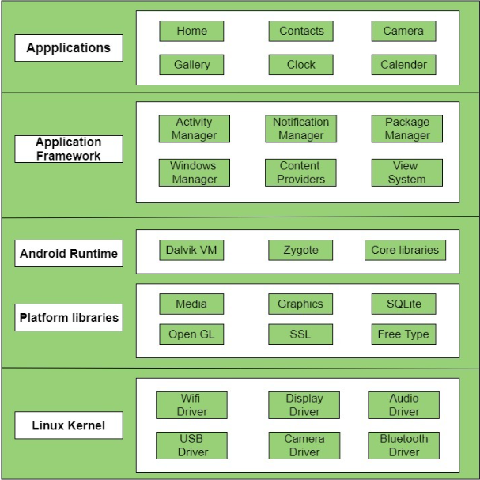

# Android Architecture:
The Android architecture consists of four main components:

- Linux Kernel: Android relies on the Linux kernel for basic system services such as memory management, process management, and network stack.

- Libraries: The Android system libraries provide a wide range of functions and features, including media playback, database access, and graphics rendering.

- Android Framework: The Android framework is a set of high-level APIs that allow developers to build app components and manage the app's life cycle. It includes the Activity Manager, Content Providers, and the View System.

- Android Applications: The top layer of the Android architecture consists of Android applications, which are the apps that users interact with on their devices. Android apps are built using the Android framework and can access the system libraries to provide features and functionality.

- This architecture allows for a high degree of customization and flexibility, making it possible for developers to build a wide range of apps for Android devices.

