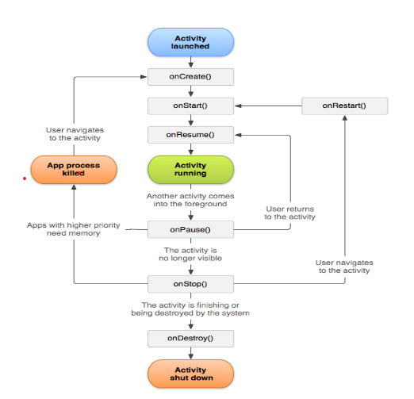
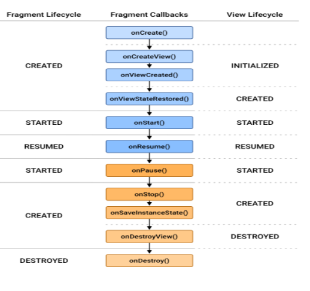

# Introduction to Activity and Fragment

## Activities

The Activity class is a crucial component of an Android app, and the way activities are launched and put together is a fundamental part of the platform's application model. Unlike programming paradigms in which apps are launched with a main() method, the Android system initiates code in an Activity instance by invoking specific callback methods that correspond to specific stages of its lifecycle.
This document introduces the concept of activities, and then provides some lightweight guidance about how to work with them. For additional information about best practices in architecting your app, see Guide to App Architecture.

### The concept of activities
The mobile-app experience differs from its desktop counterpart in that a user's interaction with the app doesn't always begin in the same place. Instead, the user journey often begins non-deterministically. For instance, if you open an email app from your home screen, you might see a list of emails. By contrast, if you are using a social media app that then launches your email app, you might go directly to the email app's screen for composing an email.

The Activity class is designed to facilitate this paradigm. When one app invokes another, the calling app invokes an activity in the other app, rather than the app as an atomic whole. In this way, the activity serves as the entry point for an app's interaction with the user. You implement an activity as a subclass of the Activity class.

An activity provides the window in which the app draws its UI. This window typically fills the screen, but may be smaller than the screen and float on top of other windows. Generally, one activity implements one screen in an app. For instance, one of an app’s activities may implement a Preferences screen, while another activity implements a Select Photo screen.
Most apps contain multiple screens, which means they comprise multiple activities. Typically, one activity in an app is specified as the main activity, which is the first screen to appear when the user launches the app. Each activity can then start another activity in order to perform different actions. For example, the main activity in a simple e-mail app may provide the screen that shows an e-mail inbox. From there, the main activity might launch other activities that provide screens for tasks like writing e-mails and opening individual e-mails.

Although activities work together to form a cohesive user experience in an app, each activity is only loosely bound to the other activities; there are usually minimal dependencies among the activities in an app. In fact, activities often start up activities belonging to other apps. For example, a browser app might launch the Share activity of a social-media app.
To use activities in your app, you must register information about them in the app’s manifest, and you must manage activity lifecycles appropriately. The rest of this document introduces these subjects.
Configuring the manifest 

For your app to be able to use activities, you must declare the activities, and certain of their attributes, in the manifest.
Declare activities
To declare your activity, open your manifest file and add an <activity> element as a child of the <application> element. For example:


```android
<manifest ... >
  <application ... >
      <activity android:name=".ExampleActivity" />
      ...
  </application ... >
  ...
</manifest >

```

The only required attribute for this element is android:name, which specifies the class name of the activity. You can also add attributes that define activity characteristics such as label, icon, or UI theme. For more information about these and other attributes, see the <activity> element reference documentation.



## Fragments

According to the Android documentation, a fragment is a part of applications user interface that is bound to an activity. Fragments have their lifecycle and layouts or UI components. Fragments help enrich your UI design, pass data between different screens, and adapt to different device configurations.
Unlike activities, fragments are usable. This means that they can be used to showcase different messages or functions to the user. These functionalities or features allow you to develop more interactive applications.

### What are fragments?
Before going any further, it’s essential to understand what fragments are or mean. As we stated above, a fragment is a part of application’s user interface that is bound to an activity. Fragments also have their logic and can thus, accept and handle different events. Fragments are beneficial since they allow code to be divided into smaller and more manageable chunks.
This simplifies the debugging process.

### Fragment lifecycle
Just like activities, fragments also have a lifecycle. This component tracks the fragments in all aspects of their lifecycle. This includes when they are initialized, started, created, resumed, and destroyed. A LifecycleObserver allows the developer to detect when a specific fragment is active. As a result, certain actions can be executed. For instance, an app can display a Snackbar or Toast message.

Alternatively, callback methods can also help in the management of the fragment’s lifecycle. These functions include onCreate, onStart, onResume, onPause, onStop, and onDestroy. The callback methods are called depending on the fragment’s state.

Such as listed below: onCreate - This method is called to initialize or add the fragment to the host activity. The layout is also inflated in this stage. All elements initialized in this method are usually preserved whenever the fragment is paused. onStart - In this step, the fragment is visible or active. Users can interact with different UI components. onPause - The activity is paused, which causes the fragment to bear a similar state. The onPause is called when a fragment is replaced or when the user chooses to navigate backward. onResume - In this phase, the fragment is reactivated. onStop - The fragment is stopped and the UI hidden from the user. onDetach and onDestroy - All of the fragment’s instances and processes are destroyed.

The image below shows how the fragment lifecycle methods are classified.




